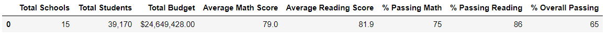
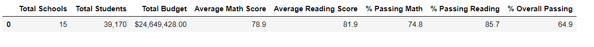
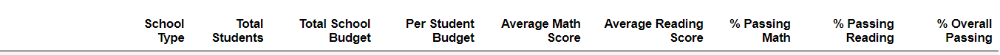
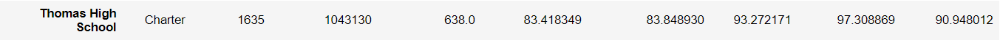
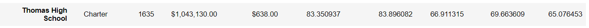

**SCHOOL DISTRICT ANALYSIS  

Overview**

This project is a mock scenario in which the chief data scientist for a city
school is responsible for analyzing information from variety of sources and
variety of formats. The task is to prepare all standardized data for analysis
and reporting to provide insights about schools’ performance trends and
patterns. These insights are used to inform discussion and strategic decisions
at the school and district level. Also, assist the school boards and
superintendent in making decisions regarding the school budget and priorities.
The analysis will also examine data on student funding and students’
standardized test scores. Data set contains information on 14 school and around
40000 students. All student’s math and reading scores as well as other
information on the schools they attend. While performing the requested task, The
Family Education Rights and Privacy act of 1974 (FERPA) was taken into
consideration and data was treated with utmost confidentiality.

To achieve the task Python, Pandas and Jupyter notebook are used to perform the
data analysis. Starting with reading raw data from CSV files, cleaning and
inspecting data, merging datasets before performing needed calculation and
creating tables to visualize the district summary.

Later on, the school board has been notified that one of the data source files
shows evidence of academic dishonesty; specifically, reading and math grades for
Thomas High School ninth graders appear to have been altered. Therefore, data
for that school needed to be disregarded and the school district analysis to be
repeated. Once new analysis is done a report on the new district summary was
requested to describe how these changes affected the overall analysis.

**Results  

**The new report shows the following:

-   **How the district summary was affected:**

Looking at original district summery (fig.01) and the new one (fig.02), we can
see that affect was quite insignificant. The average math scores went from 79 to
78.9, and average reading scores went stayed the same at 81.9. And overall
passing dropped to 64.9 compared 65.

*Figure 01*

*Figure 02*

-   **How the school summary was affected:**

Looking at the initial school summery for *Thomas High School* (*fig.03*) and
school summery after dropping math and reading scores (*fig.04*), we can
conclude that number were affected. The average scores of math and reading were
only slightly affected. However, the percentage of passing math and reading, as
well as overall passing decreased significantly which dropped from almost %91 to
%65.

*Figure 03*

*Figure 04*

-   **How did removing the ninth graders’ math and reading scores affect Thomas
    High School’s performance, relative to the other schools:**

As mentioned, overall passing has decreased which resulted in *Thomas High
School* rank dropped form the 2nd to the 8th place in the all 15 schools list.

-   Looking at (fig.03) and (fig.04) again, we see that *Thomas High School*
    overall budget and it’s spending per student remained the same.

**Summary**

Overall, the new analysis after dropping the ninth-grade reading and math scores
from *Thomas High School* caused negative changes for the school itself but not
for the district as whole. The school budget and per student spending, as well
as school size and type have dropped in value as the overall passing percentage
dropped significantly.
